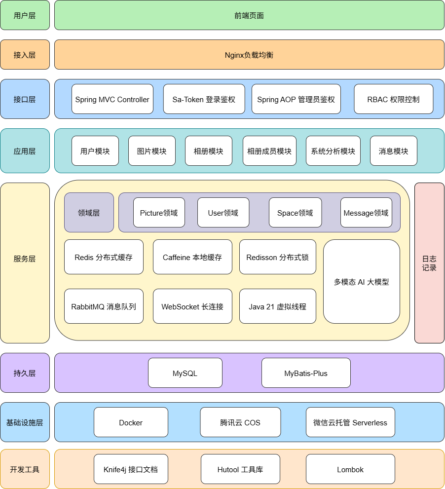

# 昴云相册 - 智能云图片管理平台


### 📌 项目概述

基于 **Java 21 虚拟线程 + SpringBoot 3 + Redis + RabbitMQ + 腾讯云 COS** 开发并采用**DDD领域驱动设计**构建的企业级智能云图库平台，支持图片上传、智能检索、个人 / 多人相册共建共享，通过多级缓存架构、Redisson 分布式锁保障高并发访问性能与数据一致性，适配个人素材管理、团队协作相册、云端资源托管等场景。

**项目技术栈：**

| 分类             | 技术选型                                         |
| ---------------- | ------------------------------------------------ |
| 基础框架         | Java 21 (虚拟线程)、SpringBoot 3.x、MyBatis‑Plus |
| 缓存 / 并发控制  | Caffeine+Redis 多级缓存、Redisson 分布式锁       |
| 消息 & 通信      | RabbitMQ、WebSocket                              |
| 权限 & 开发工具  | Sa‑Token、Knife4j、Hutool                        |
| 云存储 & AI 功能 | MySQL、腾讯云 COS、阿里云多模态AI                |


### 🏗️ 项目架构



### ⚡ 核心业务功能

1. **图片检索与查看**：支持按名称、简介模糊匹配搜索，实现多条件筛选，帮助用户快速定位目标图片；展示的图片均通过腾讯云**数据万象**服务处理，经无损压缩处理，优化图片90%体积同时展示高清图片，保证用户浏览体验
2. **图片上传**：支持单次上传、批量上传功能，上传前可通过**AI功能**，根据图片内容自动生成简介，帮助用户快速补充图片信息；图片存储于**腾讯云COS**，数据库仅存图片在线URL，提升查询响应速度与优化数据库存储空间
3. **相册管理**：支持相册创建、编辑、分类管理，实现图片资源有序化存储。通过**Sa-Token鉴权**，非管理员与创建者不可访问私人相册，实现数据的隐私性和安全性
4. **多人相册成员管理**：具备相册成员邀请、分配成员权限、多人图片资源共享管理功能，基于**RBAC权限模型**实现用户、角色、权限三层分离（创建者、管理员、访客），有效防止无权限用户修改相册数据，保障数据安全


### 🌟 项目亮点

#### 1. DDD 领域驱动设计架构
- **四层分层架构**：采用**接口层 - 应用层 - 领域层 - 基础设施层**分层实现，遵循**依赖倒置**原则，上层业务逻辑与底层存储实现解耦。例如图片领域服务不直接依赖图片仓储实现类，而是在领域层加一层仓储抽象层，使得图片领域服务与图片仓储实现类同时依赖该抽象层（基础设施层反过来依赖抽象层），实现依赖倒置
- **充血模型设计**：将图片、相册、用户核心业务规则收敛至领域层，通过充血实体承载业务逻辑，避免逻辑零散分布在业务服务中。例如图片实体类包含图片有效性校验、批量重命名方法这些只关注图片功能的方法
- **清晰限界上下文**：按业务边界划分图片、用户、相册空间、消息模块，职责划分明确，降低后续迭代维护成本。

#### 2. 高并发性能优化
- **Java21 虚拟线程**：针对图片上传、云端存储等 IO 密集型任务，使用虚拟线程降低线程调度开销，提升批量文件处理的并发能力。
- **多级缓存设计**：采用 Caffeine 本地缓存 + Redis 分布式缓存，缓存热门相册与高频访问图片数据，缩短接口响应耗时，同时有效降低缓存击穿与缓存雪崩的风险。
- **数据库查询优化**：优化相册、图片关联查询逻辑，批量加载关联数据，解决 N+1 查询问题，减少数据库交互次数。本项目查询图片时同时查询用户信息，实现原理：从图片列表查出所有用户ID，存入Set集合去重，以用户ID为键存入Map集合，批量查询用户信息

#### 3. 异步解耦与消息可靠性
- **RabbitMQ 异步解耦**：将图片 AI 描述生成逻辑异步化处理，剥离主上传流程，显著降低接口阻塞耗时，大幅提升接口响应速度。
- **消息可靠保障**：采用手动 ACK 确认 + 失败重试机制，避免消息丢失、重复消费问题，保证 AI 生成任务可靠执行。
- **消费者流量管控**：通过`prefetch=1`限制单次预取消息数量，实现消费端限流，避免瞬时消息压垮服务，防止雪崩效应。
- **实时进度推送**：结合 WebSocket 实时推送 AI 生成任务进度，让用户感知处理状态，优化整体使用体验。

#### 4. 数据一致性
- **并发数据一致性**：针对用户最大相册创建数量（5 个）场景，采用**分布式锁 + 编程式事务**保证 “查询判断 + 插入” 原子性，避免高并发下超量创建问题，保障业务规则一致性。
- **缓存更新策略：**采用 Cache-Aside Pattern 旁路缓存模式，**先查缓存，缓存没有再查数据库；写数据时先改数据库，再删缓存，确保数据库更新失败时不会把缓存删掉。**缓存不主动更新，只被动被删除，由业务代码手动控制，Redis 和数据库完全独立，在图片上传、编辑、删除等操作后，会主动清除相关缓存，保证数据一致性

#### 5. 完善的权限与安全体系
- **权限校验：**Sa-Token 方法级鉴权 + AOP 角色鉴权 、RBAC权限模型实现多人相册权限隔离
- **上传校验：**初步过滤非图片格式、非合法大小的图片，通过人工审核拦截不合法图片内容


## 📊 技术测试指标

- **AI接口**：
  - 响应时间：60ms
  - 基于RabbitMQ异步化任务，及时释放主线程

- **图片上传并发能力**：
  - QPS: 13.1req/s；
  - P95: 158ms； 
  - P99:194ms；
  - 零错误率
  - 测试环境：300个用户同时上传一张170kb的图片

- **图片列表查询**：
  - 耗时：单次查询3ms，并发平均响应73ms；
  - QPS： 3647req/s； 
  - 缓存命中率：100%
  - 测试环境：2000张图片分页20条、300个用户无限次发请求，请求间隔20s，持续3min


## 📁 项目结构

```
picture-486-backend/
├── interfaces/          # 控制层 - Controller/DTO/VO
├── application/         # 应用服务层 - 业务流程编排
├── domain/             # 领域层 - 核心业务逻辑
│   ├── picture/        # 图片领域
│   ├── user/           # 用户领域
│   ├── space/          # 空间领域
│   └── message/        # 消息领域
├── infrastructure/     # 基础设施层 - 技术实现
│   ├── mapper/         # 数据访问
│   ├── repository/     # 仓储实现
│   ├── api/            # 外部服务集成
│   ├── mq/             # 消息队列
│   └── config/         # 配置管理
└── shared/             # 共享层 - 通用能力
```

